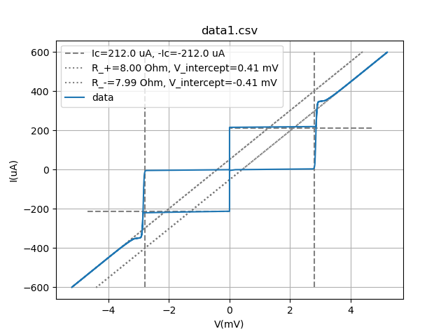
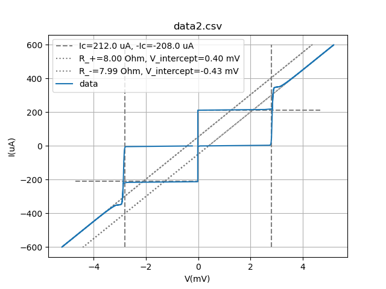
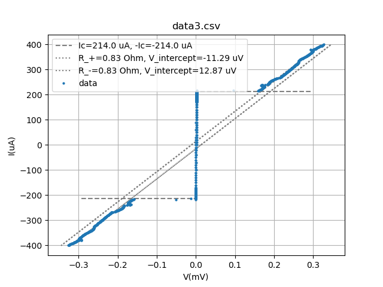
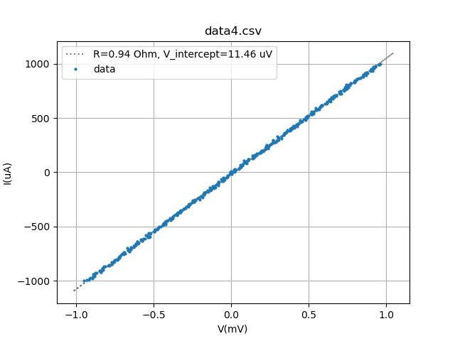
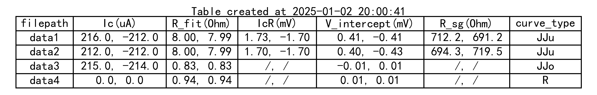

# IV数据处理库

包含两个文件: `IVDataprocess_class.py`和`IVDataprocess_aux.py`. 前者包含一个`IV数据处理类`, 用于IV数据的基本处理和拟合, 后者是辅助函数文件, 目前包含`create_table()`和`select_files()`两个函数.

## 特点

- 同时处理批量的IV数据, 得到Ic, 拟合R, 并画出图像.
- 可以自动识别电阻, 回滞结, 过阻尼结的IV曲线.
- 带有电压符号矫正功能, 可以防止实验上的电压正负接反, 导致得到一个负电阻.
- 可以自动识别IV数据中的分隔符, 无需手动输入(可能存在识别失败, 因此留了手动输入的接口).
- 结合辅助函数, 可以使用对话框选择一批IV数据文件, 并生成一个总结表, 将各个数据文件得到的拟合参数汇总到一个表格中.


## 所需库
1. numpy
2. matplotlib
3. pandas
4. scipy
5. datetime
6. tkinter(可选, 如果不调用`select_files()`函数, 则不需要)


## 使用实例
### 实例代码
`example.py`文件中给出了一个使用实例, 可以运行该文件以进行测试. 该实例代码会处理4个数据文件, 包含两个回滞结, 一个无回滞结, 一个电阻. 程序会自动识别各个曲线的类型, 做出拟合, 并画出IV曲线图. 最后会生成一个总结表格
```python
# import IVDataProcess类及辅助函数select_files和create_table.
from IVDataProcess_class import IVDataProcess
from IV_dataprocess_aux import select_files, create_table


# 数据文件格式为'IV', 即第一列为电流I, 第二列为电压V. 电流单位为A, 电压单位为V.
data_type, I_unit, V_unit = "IV", "A", "V"

# 文件路径列表, 手动输入
file_paths = ["data1.csv", "data2.csv", "data3.csv", "data4.csv"]

# 文件路径列表, 使用对话框选择文件, 需要安装tkinter模块
# file_paths = select_files()

ivs = []*len(file_paths) # 创建一个IVDataProcess对象列表
# 遍历文件路径列表, 依次处理数据, 并拟合, 画图
for file_path in file_paths:
    #创建一个IVDataProcess对象
    iv = IVDataProcess(file_path, data_type, I_unit, V_unit)
    ivs.append(iv)

    #读取数据文件
    iv.file_read() 

     #计算偏置电压V_offset并去除
    iv.remove_V_offset()

    #矫正V_data的正负号, 防止电阻为负
    iv.Vdata_correct() 

    #判断IV曲线的类型
    iv.curve_classifier() 

    #得到正反向的临界电流
    iv.get_Ic() 

    #拟合电阻R
    iv.fit_R()

    #画图
    iv.plot_IV(save_fig=False)

# 创建一个总结表格
fit_results = [iv.fit_result for iv in ivs]
curve_types = [iv.curve_type for iv in ivs]
create_table(file_paths, fit_results, curve_types, save_table=False)
```
运行该脚本, 会依次处理4个数据文件`["data1.csv", "data2.csv", "data3.csv", "data4.csv"]`, 并画出IV曲线图. 最后会生成一个总结表格. 

### 输出结果
- 4个IV曲线图.
- 1个数据总结表.










## IVDataProcess类说明
### 变量
- `file_path(str)`: data文件路径. 路径的斜杠必须使用"/".
- `data_type(str)`: 数据类型, 可选IV或VI. 分别代表两列数据是电流电压还是电压电流.
- `I_unit(str)`: 电流单位, 默认为A.
- `V_unit(str)`: 电压单位, 默认为V.
-` data_sep(str)`: IV数据分隔符, 
- `V_g(float)`: 结的gap电压, 默认为2.8e-3V.
- `filename(str)`: 文件名.
- `V_offset(float)`: V_offset值, 默认为0.0. V_offset值是指电压数据中的偏移值.
- `fit_result(np.ndarray)`: 拟合结果数组, 长度为6. 依次是Ic_1, Ic_2, R_fitp, R_fitm, Vintcp_p, Vintcp_m.
- `I_data(np.ndarray)`: 根据`I_unit(str)`处理后的电流数据.
- `V_data(np.ndarray)`: 根据`V_unit(str)`处理后的电压数据.
- `I_raw(np.ndarray)`: 原始电流数据.
- `V_raw(np.ndarray)`: 原始电压数据.
- `curve_type(str)`: IV曲线的类型, 可选R, JJu, JJo.
- `Ic_fitp(float)`: 正向临界电流.
- `Ic_fitm(float)`: 负向临界电流.
- `R_fitp(float)`: 正向拟合电阻.
- `R_fitm(float)`: 负向拟合电阻.
- `Vintcp_p(float)`: 正向R拟合后在V轴的截距.
- `Vintcp_m(float)`: 负向R拟合后在V轴的截距.
- `segms(list[dict, dict, dict, dict])`: 四段IV曲线的字典. 字典的key是'I'和'V', value是对应的电流和电压数据. 四段分别是电流从0上升到最大, 从最大下降到0, 从0下降到最小, 从最小上升到0.
- `n_convolve(int)`: 对R_diff进行平滑处理时的卷积核大小, 默认为1.

### 方法
- `file_read()`: 根据file_path读取数据文件, 得到self.I, self.V两个数组(量纲为A, V), 同时还会保存原始数据在self.I_raw, self.V_raw的两个数组中.
- `IV_unit_convert()`: 将原始数据转换为指定单位的数据.
- `get_separator()`: 从文件中读取中间一行数据, 并根据这行数据自动判断分隔符.
- `remove_V_offset()`: 获取V_offset值, 并将V_data减去offset.
- `curve_classifier()`: 判断IV曲线的类型, 并返回.
- `get_Ic()`: 获取Ic_fitp和Ic_fitm, 即正向和负向的临界电流.
- `fit_R()`: 对IV曲线进行R拟合, 得到Rp和Rm.
- `IVdata_split_4_segments()`: 将数组 I_data和V_data 分成四段: 上升段、下降到零段、下降段、上升到零段.
- `Vdata_correct()`: 矫正V_data的正负号.
- `plot_IV()`: 画IV曲线图, 根据I_data和V_data而不是I_raw和V_raw. 画图时会根据IV曲线的类型, 临界电流, R拟合结果, V_g等信息进行标注. 画图时会自动调整电流和电压的单位, 使得数值不会太大或太小.


## 待更新的功能
- **增加两种曲线**: 当前只能识别`R`, `JJu`, `JJo`三种曲线. 将来会增加`JJa`(结阵), `JJs`(不同Ic的结串联). 对于`JJa`, 增加一个Ic-spread的分析功能. 对于`JJs`, 增加一个Jc的拟合功能.
- **优化R拟合所用IV数据**: 当前的`JJu`和`JJo`的电阻拟合所用到的I, V数据, 是固定范围的. 因为IV曲线的特点是越大的I和V, R拟合越准确. 将来需要根据数据点的数量和大小动态选择拟合R所用的数据范围. 同时还需要保留接口, 可以手动选择拟合所用的数据范围.
- **数据分隔符的判断**: 目前对于固定字符长度的数据文档, 其分隔符随数据长度的变化而变. 当前的分隔符识别方案并不能识别这种情况. 
- **改变数据分块**: 当前`IVdata_split_4_segments()`会将数据分成四段, 这要求了IV数据必须包含正向和负向的扫描, 需要更改以适配单边IV扫描.