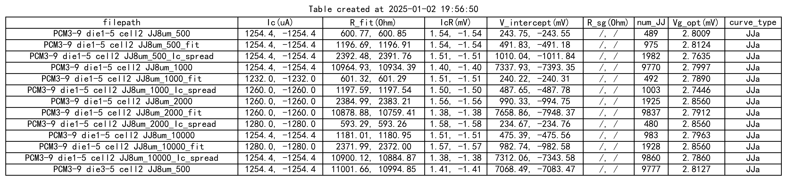

# IV数据处理库

包含两个文件: `IVDataprocess_class.py`和`IVDataprocess_aux.py`. 前者包含一个`IV数据处理类`, 用于IV数据的基本处理和拟合, 后者是辅助函数文件, 目前包含`create_table()`和`select_files()`两个函数.

另外包含一个文件夹`GUI_IV`, 里面包含GUI界面的代码. GUI功能正在调试中, 目前未正式上线. 目前已有选择性画图, 添加不同文件夹下的数据, 不同数据画在同一张图上的功能. 如需使用, 可运行`gui_test.py`文件进行测试.

## 特点

- 同时处理批量的IV数据, 得到Ic, 拟合R, 线性插值得到R_sg(`V1.2`更新) 并画出图像.
- 可以自动识别电阻, 回滞结, 过阻尼结, 结阵(`V1.2`更新) 的IV曲线.
- 带有电压符号矫正功能, 可以防止实验上的电压正负接反, 导致得到一个负电阻.
- 可以自动识别IV数据中的分隔符, 无需手动输入(可能存在识别失败, 因此留了手动输入的接口).
- 结合辅助函数, 可以使用对话框选择一批IV数据文件, 并生成一个总结表, 将各个数据文件得到的拟合参数汇总到一个表格中.


## 所需库
1. numpy
2. matplotlib
3. pandas
4. scipy
5. datetime
6. tkinter(可选, 如果不调用`select_files()`函数, 则不需要)

## 结阵和R_sg处理说明
### R_{sg}的处理
程序中计算`R_sg`是默认在2mV的电压下, 直接计算V/I得到. 如果扫描的电流不进太大, 没有数据点在2mV, 那么会取最接近2mV的左右两个点, 线性插值得到. 2mV的电压可以改动, 程序中可以计算任意电压下的R_sg, 只需在定义`IVDataProcess`对象时, 传入`V_sg`参数即可.

在目前已有的大部分数据(包括济南和北京)中, 基本没有数据在2mV, 线性差值的两个点, 一个接近0mV, 一个接近2.8mV(V_g), 线性差值后得到的`R_sg`都非常大, 一般在几百欧姆, 这不符合实际. 因此, 想得到可信的`R_sg`, 需要在实验中扫描更加精细.

实际上, R_sg的实验典型值咋几十欧姆至一两百欧姆间. 取V = 2 mV, 计算得到 I~10uA. **这要求实验上的电流扫描范围要小于10 uA, 保险起见必须小于5 uA.**

### 结阵的处理
在`V1.2`版本中, 增加了对结阵数据的处理. 除了基本的参数拟合外, 还增加了一个`Ic-spread`的分析功能. 即得到不同值的Ic对应的V值, 并可以画出图像. 如下图是北京测到的`PCM3-9 die5-5 cell2 JJ8um_10000-re`数据的处理结果:


`Ic-spread`的分析原理是根据IV曲线中的电压差来判定结的个数, 每相差一个V_g, 即认为有一个结. 预设一个`V_g`然后计算每个电压差里有多少个结(通常是一个小数而不是整数), 把小数部分记录下来, 然后对所有的小数部分求和, 这个和最小的`V_g`就是最优的`V_g`. 通过这个`V_g`可以得到每Ic对应的结个数, 进而得到Ic-spread图.

这种方法的好处是程序处理十分的快速, 优化速度也很快. 主要缺点有两个, 一是不符合实际. 因为实际的结阵的每个结的V_g并不是相同的, 有一定分布. 第二是对于很大的V常常计算不准确, 例如无法区分200和201个结的V值差异. **对于一些数据点比较稀疏的数据, 计算的结的数目不是很可靠, 有时会很小或很多, 甚至超出实际制造的结的数目.** 

**对实验上测试的需求是, 降低I的步进, 使得每个I步进下跳转的结的数目不超过50个, 即V跳变不超过0.14V.**

目前正在开发另一种处理`Ic-spread`的方法, 该方法是先预设V_g满足一个高斯分布, 然后计算这个分布下, 得到各个电压差的概率. 改变V_g的分布参数, 计算出出现实际测量数据中的电压差的最大概率, 即得到最优的V_g分布. 该方法的优点是更加符合实际, 缺点是计算量大, 速度慢. 该方法还在开发中, 目前使用动态规划的方法有效降低运行时间, 一般处理一个数据文件的`Ic-spread`图像只需要几十秒. 继续优化速度后, 会更新到后续版本中. 希望得到测试人员和脚本使用人员的支持和反馈.


## 使用实例
### 实例代码
`example.py`文件中给出了一个使用实例, 可以运行该文件以进行测试. 该实例代码会处理4个数据文件, 包含两个回滞结, 一个无回滞结, 一个电阻. 程序会自动识别各个曲线的类型, 做出拟合, 并画出IV曲线图. 最后会生成一个总结表格
```python
# import IVDataProcess类及辅助函数select_files和create_table.
from IV_data_process.IVDataProcess_class import IVDataProcess
from IV_data_process.IV_dataprocess_aux import select_files, create_table


# 数据文件格式为'IV', 即第一列为电流I, 第二列为电压V. 电流单位为A, 电压单位为V.
data_type, I_unit, V_unit = "IV", "A", "V"

# 文件路径列表, 手动输入
# file_paths = ["data1.csv", "data2.csv", "data3.csv", "data4.csv"]

# 文件路径列表, 使用对话框选择文件, 需要安装tkinter模块
file_paths = select_files()

ivs = []*len(file_paths) # 创建一个IVDataProcess对象列表
# 遍历文件路径列表, 依次处理数据, 并拟合, 画图
for file_path in file_paths:
    try:
    #创建一个IVDataProcess对象
        iv = IVDataProcess(file_path, data_type, I_unit, V_unit)
        

        #读取数据文件
        iv.file_read()

        #计算偏置电压V_offset并去除
        iv.remove_V_offset()

        #矫正V_data的正负号, 防止电阻为负
        iv.Vdata_correct() 

        #判断IV曲线的类型
        iv.curve_classifier() 

        #得到正反向的临界电流
        iv.get_Ic() 

        #拟合电阻R
        iv.fit_R()

        # 计算Rsg, 只会对JJu曲线进行计算.
        iv.get_Rsg()

        # 计算Ic_spread, 只会对JJa曲线进行计算.
        iv.get_Ic_spread(print_info=False)

        #画图
        iv.plot_IV(linestyle='o', save_fig=False)
        iv.plot_Ic_spread(save_fig=False) # Ic_spread图, 只对JJa曲线有效
        ivs.append(iv)

    except:
        print(f'文件{file_path}处理失败')
        continue

# 创建一个总结表格
fit_results = [iv.fit_result for iv in ivs]
curve_types = [iv.curve_type for iv in ivs]
Rsg_results = [iv.Rsg_result for iv in ivs]
array_params = [[iv.num_JJ, iv.Vg_optimal] for iv in ivs]
create_table(file_paths, fit_results, curve_types, Rsg_results, array_params, save_table=False)
```
运行该脚本, 会依次处理4个数据文件`["data1.csv", "data2.csv", "data3.csv", "data4.csv"]`, 并画出IV曲线图. 最后会生成一个总结表格. 

### 输出结果
- 4个IV曲线图.
- 1个数据总结表.
<div style="display: flex; justify-content: center; gap: 20px;">


</div>

<div style="display: flex; justify-content: center; gap: 20px;">


</div>


### 对于结阵(JJa)的处理
结阵的处理依旧可使用`example.py`中的代码, 程序中会自动识别并处理.

一下是一个结阵数据处理后的总结表格:




## IVDataProcess类说明
### 属性
- `file_path(str)`: data文件路径. 路径的斜杠必须使用"/".
- `data_type(str)`: 数据类型, 可选IV或VI. 分别代表两列数据是电流电压还是电压电流.
- `I_unit(str)`: 电流单位, 默认为A.
- `V_unit(str)`: 电压单位, 默认为V.
-` data_sep(str)`: IV数据分隔符, 
- `V_g(float)`: 结的gap电压, 默认为2.8e-3V.
- `filename(str)`: 文件名.
- `V_offset(float)`: V_offset值, 默认为0.0. V_offset值是指电压数据中的偏移值.
- `fit_result(np.ndarray)`: 拟合结果数组, 长度为6. 依次是Ic_1, Ic_2, R_fitp, R_fitm, Vintcp_p, Vintcp_m.
- `I_data(np.ndarray)`: 根据`I_unit(str)`处理后的电流数据.
- `V_data(np.ndarray)`: 根据`V_unit(str)`处理后的电压数据.
- `I_raw(np.ndarray)`: 原始电流数据.
- `V_raw(np.ndarray)`: 原始电压数据.
- `curve_type(str)`: IV曲线的类型, 可选R, JJu, JJo.
- `Ic_fitp(float)`: 正向临界电流.
- `Ic_fitm(float)`: 负向临界电流.
- `R_fitp(float)`: 正向拟合电阻.
- `R_fitm(float)`: 负向拟合电阻.
- `Vintcp_p(float)`: 正向R拟合后在V轴的截距.
- `Vintcp_m(float)`: 负向R拟合后在V轴的截距.
- `segms(list[dict, dict, dict, dict])`: 四段IV曲线的字典. 字典的key是'I'和'V', value是对应的电流和电压数据. 四段分别是电流从0上升到最大, 从最大下降到0, 从0下降到最小, 从最小上升到0.
- `V_sg(float)`: subgap电压, 默认为2.0e-3V. &#9733; `V1.2更新` &#9733;
- `Rsg_p(float)`: 正向subgap电阻. &#9733; `V1.2更新` &#9733;
- `Rsg_m(float)`: 负向subgap电阻. &#9733; `V1.2更新` &#9733;
- `Rsg_result(tuple)`: Rsg_p, V1_p, V2_p, Rsg_m, V1_m, V2_m. &#9733; `V1.2更新` &#9733;
- `num_JJ(int)`: IV曲线中的结的个数. &#9733; `V1.2更新` &#9733;
- `Vg_optimal(float)`: JJa数据优化后的gap电压. &#9733; `V1.2更新` &#9733;
- `Ic_array(np.ndarray)`: Ic_spread计算时的Ic数组, 即Ic的可能取值. &#9733; `V1.2更新` &#9733;
- `JJ_counts(np.ndarray)`: Ic_spread计算时的JJ_counts数组, 即每个Ic对应的JJ数. &#9733; `V1.2更新` &#9733;
- `n_convolve(int)`: 对R_diff进行平滑处理时的卷积核大小, 默认为1. &#9733; `V1.2更新` &#9733;

### 方法
- `file_read()`: 根据file_path读取数据文件, 得到self.I, self.V两个数组(量纲为A, V), 同时还会保存原始数据在self.I_raw, self.V_raw的两个数组中.
- `IV_unit_convert()`: 将原始数据转换为指定单位的数据.
- `get_separator()`: 从文件中读取中间一行数据, 并根据这行数据自动判断分隔符.
- `remove_V_offset()`: 获取V_offset值, 并将V_data减去offset.
- `curve_classifier()`: 判断IV曲线的类型, 并返回.
- `get_Ic()`: 获取Ic_fitp和Ic_fitm, 即正向和负向的临界电流.
- `fit_R()`: 对IV曲线进行R拟合, 得到Rp和Rm.
- `get_Rsg()`: 根据JJu类型曲线的回滞段, 得到subgap电阻的Rsg_p和Rsg_m, 以及插值用的V1, V2. &#9733; `V1.2更新` &#9733;
- `get_Ic_spread()`: 计算Ic_spread, 只会对JJa曲线进行计算. &#9733; `V1.2更新` &#9733;
- `IVdata_split_4_segments()`: 将数组 I_data和V_data 分成四段: 上升段、下降到零段、下降段、上升到零段.
- `Vdata_correct()`: 矫正V_data的正负号.
- `plot_IV()`: 画IV曲线图, 根据I_data和V_data而不是I_raw和V_raw. 画图时会根据IV曲线的类型, 临界电流, R拟合结果, V_g等信息进行标注. 画图时会自动调整电流和电压的单位, 使得数值不会太大或太小.
- `plot_Ic_spread()`: 画Ic_spread图, 只对JJa曲线有效. &#9733; `V1.2更新` &#9733;


## 待更新的功能
- **增加曲线种类**: 当前只能识别`R`, `JJu`, `JJo`和`JJa`(结阵)四种曲线. 将来会增加`JJs`(不同Ic的结串联), 增加一个对应的Jc的拟合功能.
- **优化R拟合所用IV数据**: 当前的`JJu`和`JJo`的电阻拟合所用到的I, V数据, 是固定范围的. 因为IV曲线的特点是越大的I和V, R拟合越准确. 将来需要根据数据点的数量和大小动态选择拟合R所用的数据范围. 同时还需要保留接口, 可以手动选择拟合所用的数据范围.
- **数据分隔符的判断**: 目前对于固定字符长度的数据文档, 其分隔符随数据长度的变化而变. 当前的分隔符识别方案并不能识别这种情况. 
- **改变数据分块**: 当前`IVdata_split_4_segments()`会将数据分成四段, 这要求了IV数据必须包含正向和负向的扫描, 需要更改以适配单边IV扫描.